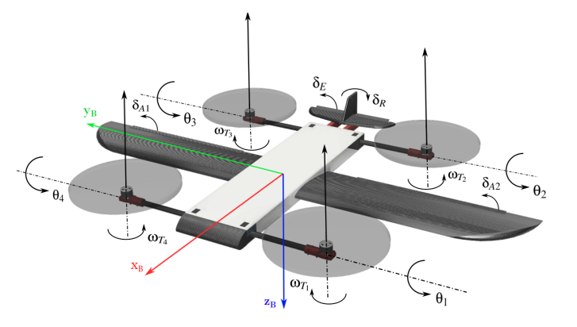

# Dokumentacja techniczna VTOL-a

**1. Cel i założenia projektowe**

**1.1 Cel**

 Statek powietrzny w konfiguracji Tilt-Rotor posiada cztery silniki, które pochylają
się do przodu co zapewnia jemu poziomą składową siły ciągu. Samolot taki zyskuje
wiele pozytywnych cech – między innymi może rozwijać dużo większe prędkości lotu ze
względu na udział czterech zespołów napędowych w generowaniu siły ciągu. Ponadto
zwiększona liczba zmiennych sterujących pozwala na uzyskanie lepszych rezultatów pod
względem jakości sterowania przy zastosowaniu odpowiednio zaawansowanych algorytmów regulacji.

**1.2 Założenia projektowe**

* BSP o masie własnej do 5kg oraz udźwigu 2kg
* Możliwość w trybach lotu manualnym oraz automatycznym, gdzie przejście z lotu
w zawisie do lotu poziomego dzieje się bez zewnętrznej interakcji.
* Zasięg w trybie płatowca do 50km.
* Długotrwałość lotu w trybie płatowca do 45 min przy prędkości przelotowej.
* Prędkość przelotowa 30 m/s.

**2. Wykaz podsystemów i użytych elementów**

**2.1 Sekcja Awioniki**
1. Kontroler lotu
The Orange Cube + with Carrier Board
    1. https://3d-services.eu/p/19/7607/the-cube-orange-standard-set-autopiloty.
    2. https://docs.cubepilot.org/user-guides/autopilot/the-cube.html
2. Komputer pokładowy nr 1 (prototyp)
Raspberry Pi 5 16GB
https://botland.com.pl/moduly-i-zestawy-raspberry-pi-5/25860-raspberry-pi-5-16gb-html
3. Komputer pokładowy nr 2 (docelowy)
Jetson Orin Nano 8GB
https://kamami.pl/zestawy-deweloperskie-jetson/1184505-nvidia-jetson-orin-nano-8ghtml
4. Iterfejs DroneCAN
Matek CAN Node G474
https://rcmaniak.pl/pl/p/MATEk-AP_Periph-CAN-Node-CAN-G474/5808
5. Odbiornik radiowy (prototyp)
FrSky R-XSR
https://dronavista.pl/pl/akcesoria/6558-frsky-r-xsr-odbiornik-z-telemetria.
html
6. Odbiornik telemetrii (prototyp)
SiK Radio v3
https://holybro.com/products/sik-telemetry-radio-v3
7. Odbiornik radiowy, obrazu i telemetrii (docelowy)
Herelink Air Unit
https://irlock.com/products/herelink-air-unit

**2.2 Sekcja Zasilania**

1. Akumulator LiPo 6S
Tatuu 6S 6000mAh
https://rcmaniak.pl/pl/p/Tattu-G-Tech-6000mah-22.2V-150C-Lipo-Battery-with-AS150-5946
6
2. ESC 4in1
Speedybee 60A 30x30
https://rcmaniak.pl/pl/p/SpeedyBee-BLS-60A-30x30-ESC/5706
3. Przetwornice DC-DC/BEC
Matek UBEC DUO 4A-12V i 4A-5V
https://rcmaniak.pl/pl/p/Matek-UBEC-DUO-4A-12V-4A-5V/4493

**2.3 Sekcja Sensorów i Układów Pomiarowych**

1. Moduł GPS
ProfiCNC Here 4 Multiband DroneCAN RTK GNSS
https://www.drony.net/proficnc-hex-here4-multiband-rtk-gnss.html
2. Moduł Pitot
MATEK ASPD-DLVR UAVCAN Pitot Sensor
https://www.nobshop.pl/matek-aspd-dlvr-i2c-uavcan-cyfrowy-czujnik-predkosci-rurkahtml
3. Power Module
Mini Power Brick https://rcdrone.top/pl/products/hex-hexing-pixhawk2-power-module-asrsltid=AfmBOopVEx3vNzxT-EvwA7AMXpH3yzNqaYft8UvfNdYA1pa2ClldmSb2

**2.4 Sekcja Napędów**

1. Serwomechanizm MG995
https://botland.com.pl/serwa-typu-standard/817-serwo-towerpro-mg-995-standard-5904422329723.html
2. Silnik bezszczotkowy T-MOTORHOBBY VELOX VICTORY V3008 1350KV
https://www.tmotorhobby.com/goods-1198-TMOTOR++VELOX+VICTORY+V3008+CINEMATIC+FPV+DRONE+MOTOR+-+1350KV.html
3. Regulator prędkości obrotowej PULS 100A ESC
????

**2.5 Sekcja Konstrukcyjna**

**2.6 Sekcja Modułu Recovery**
