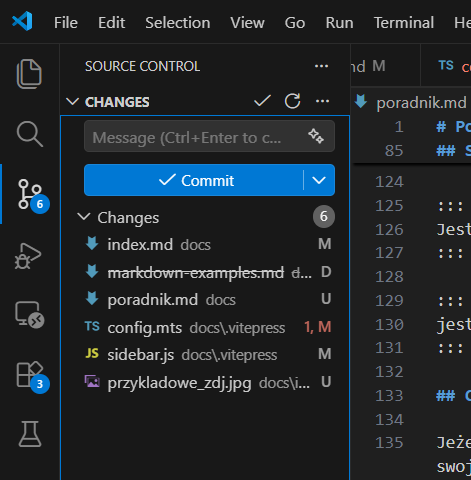
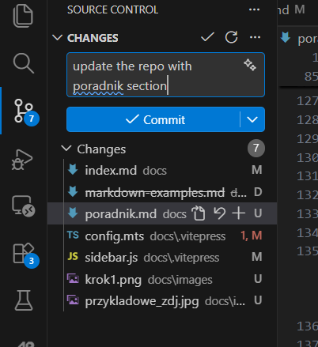
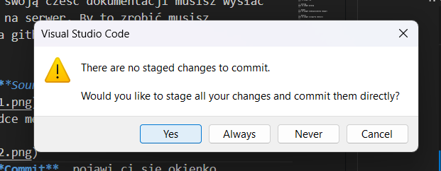
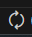

# Poradnik jak edytować stronę?

W tej stronie przedstawie ci podstawowy jak edytować tą stronę, jak wygląda struktura plików i jak ona działa oraz podstawy markdowna jak i rozszerzenia vitepress.

## Struktura plików

Struktura plików wygląda następująco:
```
├───.github
│   └───workflows
└───docs
    ├───.vitepress
    ├───Dla_początkujących
    ├───Elektronika
    ├───Mechanika
    ├───projekty
    │   └───images
    ├───Software
    │   ├───Companion_computer
    │   └───Symulacja
    └───Testy
```
Z czego foldera ***.github*** i ***.vitepress*** nie musisz edytowć (chyba że jesteś z sekcji software'u). Spostrzegawczy czytelnik zauważy że foldery w folderze ***docs*** odpowiadają bocznemu pasku nawigacji. I dokładnie tym on jest, jak widzisz struktura plików ma bezpośrednie odzworowanie na **stronie**.

### Co to tak naprawde oznacza?
Dzięki temu jak chcesz edytować bądź stworzyć nową podstronę na dany temat możesz bezpośrednio wejść do folderu i edytować bądź stworzyć nowy plik.


## Jak edytować pliki .md?

Najłatwiej jest edytować pliki .md w programie VS Code ponieważ ma on aktywny podgląd na zmiany (coś na wzór overleef'a), ale można je edytować w dowolnym edytorze tekstowym. Sam format plików .md ma pare przydatnych metod które mogłeś zobaczyć czytając ten poradnik. Oto najważniejsze z nich:

* Pogrubienie tekstu: \*\*tekst** efekt **tekst**
* Kursywa tekstu: \*tekst* efekt *tekst*
* Kursywa i pogrubienie tekstu: \*\*\*tekst** efekt ***tekst***
* dodanie punktu: 
```
* przykłądowy punkt
```
efekt
* przykłądowy punkt
* dodanie tabeli:
```
|dron| waga [Kg] |
|------|------|
| Mamba  | 5   |
| Vtol | 3   |
```
efekt
|dron| waga [Kg] |
|------|------|
| Mamba  | 5   |
| Vtol | 3   |

* dodanie kawałka kodu do skopiowania:
````
```
git clone https://github.com/KNR-PW/dron-docs.git
```
````
efekt
```
git clone https://github.com/KNR-PW/dron-docs.git
```

* Dodanie równania Latex:
```
$$
p + \frac{1}{2}\rho v^2 + \rho g h = \text{const}
$$
```
efekt
$$
p + \frac{1}{2}\rho v^2 + \rho g h = \text{const}
$$
* Dodanie zdjęcia:
```

```
::: warning
ścieżka do zdjecia zawsze powinna wyglądać tak: ./images/nazwa_zdj.png Gdzie folder images jest odniesieniem do folderu images w danej sekcji jeżeli nie widzisz zdjęcia na podglądzie to znaczy że wkleiłeś do złego folderu 
:::
efekt

## Specjalne bloki formatowania VitePress
Strona ta działa na silniku vitepress który generuje strone na podstawie plików .md (jest to ta sama technologia której używa PX4). Urozmaica ona markdowna o różne bloki funkcyjne które zostały przedstawione poniżej:
**Składnia bloku funkcyjnego**

```md
::: info
Jest to informacyjny widget
:::

::: tip
Jest to widget tip
:::

::: warning
Jest to widget warming
:::

::: danger
Jest to widget niebezpieczeństwa (danger)
:::

::: details
jest to widget szczegułów (details)
:::
```

**Efekt**

::: info
Jest to informacyjny widget
:::

::: tip
Jest to widget tip
:::

::: warning
Jest to widget warming
:::

::: danger
Jest to widget niebezpieczeństwa (danger)
:::

::: details
jest to widget szczegułów (details)
:::

## Co dalej jak już napisałem swoją podstrone?

Jeżeli już napisałeś swoją cześć dokumentacji musisz wysłać swoje zmiany lokalne na serwer. By to zrobić musisz "zpuszować" zmiany na githuba. Możesz to zrobić w następujący sposób:

1. Otwórz zakładke ***Source control*** w VS Code:

2. Następnie w zakładce message opisz co udało ci się udokumentować

3. Naciśnij guzik ***Commit***, pojawi ci się okienko w którym musiz nacisnąć ***yes***

4. Teraz musisz nacisnąć przycisk w lewym dolnym rogu o takim kształcie:

5. Pojawi ci się okienko w którym musisz nacisnąć guzik ***ok*** 

Brawo udało ci się wysłać twoje zmiany na serwer teraz musis chwile poczekać aż będziesz mógł zobaczyć swoje zmiany na stronie (przeważnie to trwa kilka minut). 

::: info
Jeżeli widzisz jakiś błąd lub literówke na tej stronie możesz ją poprawić
:::
