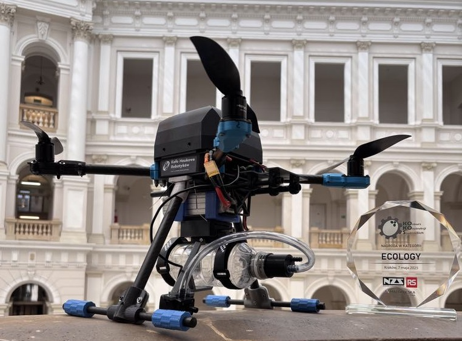

# Orzeł 1
**Parametry:**  
* Masa: 2 kg
* Udźwig 2kg
* Czas lotu: 20-25 minut  

Najstarsza jednostka latająca w naszym projekcie, zbudowana w styczniu 2024 roku. Został zbudowany w odpowiedzi na zawody Droniada 2024. Startował w konkurencjach „Sztafeta” oraz „Kopalnie marsjańskie”. W 2025 roku jednostka wykorzystana została na Droniadzie w konkurencji „Inspekcja”, dodatkowo pierwszy raz nasza sekcja brała udział w konkursie KOKOS, na którym zaprezentowano rozwiązanie pobierania próbek wody za pomocą ww. jednostki, dzięki czemu zajęliśmy 1 miejsce w kategorii „Ecology”.

