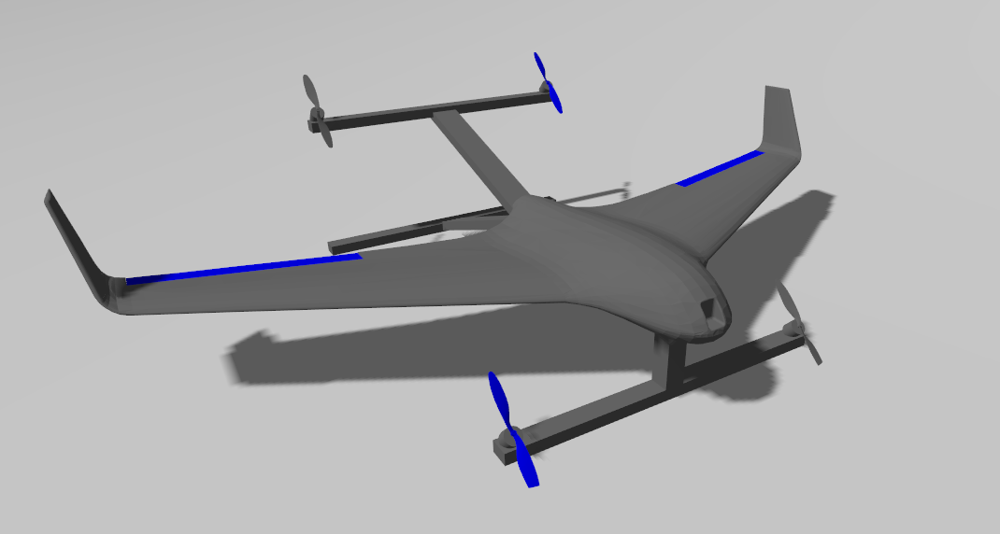

# Informacje dotyczace projektu KNR VTOL tiltrotor  

Najnowsza konstrukcja w stajni sekcji. Praca koncepcyjna nad projektem zaczęła się w maju 2025 roku. Jest to konstrukcja typu VTOL tilt-rotor, co oznacza, że dron może latać zarówno w formie quadrokoptera, jak i płatowca. To najbardziej złożony technicznie BSP w naszej sekcji. Łączy on wiele aspektów technicznych, takich jak: aerodynamika, wytrzymałość konstrukcji, analiza drgań, algorytmy wizyjne, sztuczna inteligencja, symulacje robotyczne oraz wykorzystanie zaawansowanych komponentów pokładowych, tj. LiDAR, GPS RTK, komputer pokładowy NVIDIA Jetson oraz kamery fotogrametryczne i wizyjne.

Konstrukcja rozwijana jest z myślą o zaawansowanych autonomicznych misjach oraz udziale w międzynarodowych zawodach dronowych, m.in. SUAS 2026.

::: info
Wygląd vtola w symulacji
:::